# Prueba Técnica para DevOps Junior

<b>Vacante:</b> Analista Junior CloudOps
<br>
<b>Nombre del candidato:</b> Nicolás Sosa
<br>
<b>Fecha:</b> 2024-09-03
<br>
<br>
<b>Objetivo:</b> Evaluar las habilidades fundamentales en la implementación de infraestructura
como código, automatización de despliegues, y manejo de entornos en la nube.

# Requisitos

1. node.js versión 14 o superior <a href="https://nodejs.org/en">Clic</a>
2. Docker Desktop <a href="https://www.docker.com/products/docker-desktop/">Clic</a>
3. Cuenta de AWS <a href="https://aws.amazon.com/es/free/?gclid=CjwKCAjw59q2BhBOEiwAKc0ijYe6t0Ac-9NNsK7XOIIqHgjcMF_3HByJuyhmhbwj2cUgjBdEhfbQzxoCGyIQAvD_BwE&trk=8fa18207-f2c2-4587-81a1-f2a3648571b3&sc_channel=ps&ef_id=CjwKCAjw59q2BhBOEiwAKc0ijYe6t0Ac-9NNsK7XOIIqHgjcMF_3HByJuyhmhbwj2cUgjBdEhfbQzxoCGyIQAvD_BwE:G:s&s_kwcid=AL!4422!3!647999789205!e!!g!!aws!19685287144!146461596896&all-free-tier.sort-by=item.additionalFields.SortRank&all-free-tier.sort-order=asc&awsf.Free%20Tier%20Types=*all&awsf.Free%20Tier%20Categories=*all">Clic</a>

# Clonar repositorio

```cmd
mkdir laboratorio
cd laboratorio

git clone https://github.com/narto12345/Prueba_Tecnica_Iris.git

cd Prueba_Tecnica_Iris
```

# 1. Crear una instancia de EC2 en AWS:

El primer ejercicio consiste en crear una instancia de EC2 mediante CloudFormation que tenga las siguientes caracterisiticas:

- **Tipo:** t2.micro
- **Región:** us-east-1
- **OS:** Ubuntu
- clave SSH para acceso
- SSH puerto 22 solo desde nuestra IP

En el directorio **Punto-1** encontrará un fichero plantilla .yaml que contiene el código de CloudFormation con cada una de los requerimientos mencionados.

## Ejecución del Script en AWS

Una vez haya iniciado sesión en su cuenta de AWS, siga lo siguientes pasos:

1. Entrar a CloudFormation:

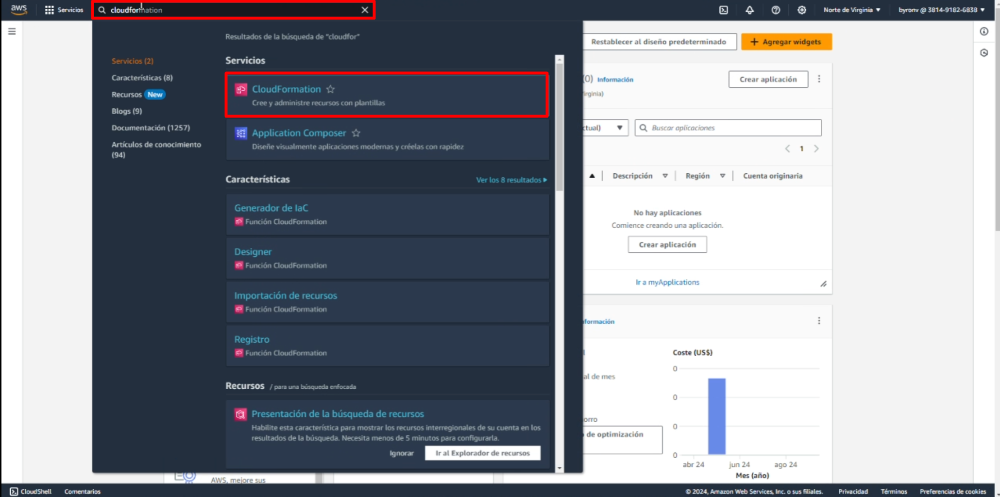

2. Crear una pila:

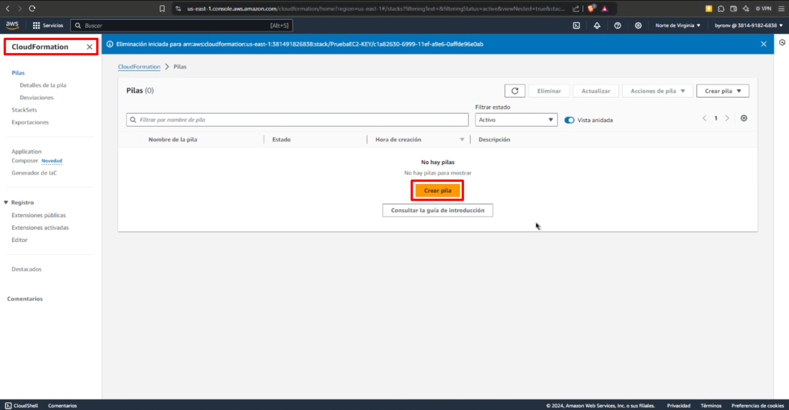

3. Adjuntar plantilla:

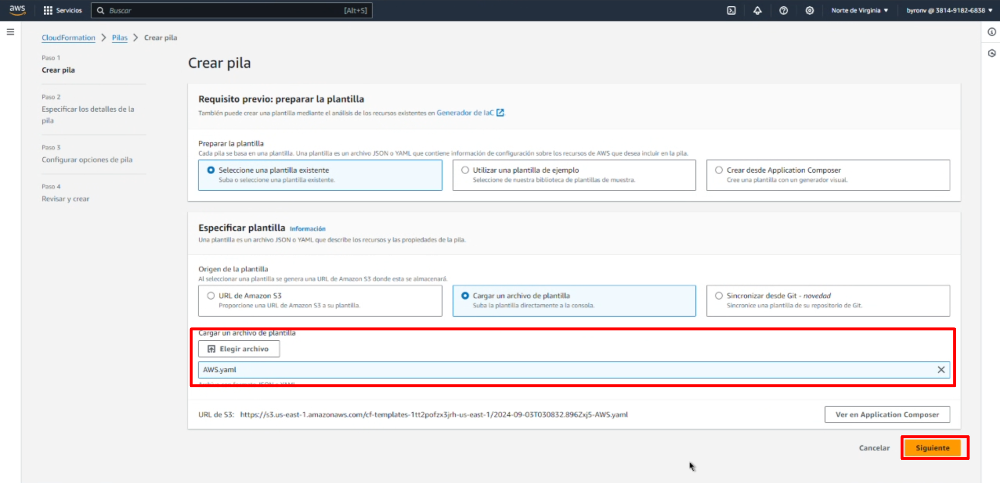

4. Especificar los detalles de la pila:

- En el parámetro **AllowedIP** digite su IP pública y seguidamente **/32** para establecer una mascara que limite la cantidad de IPs disponibles.

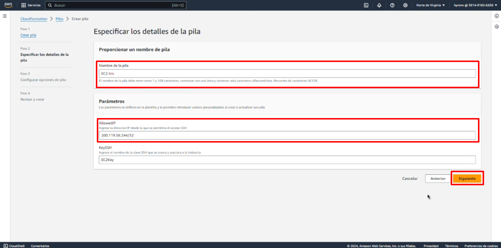

5. Siguiente:

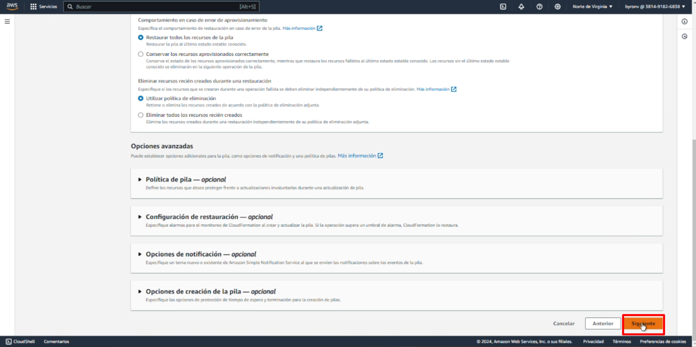

6. Validar el correcto mapeo de la configuración de la plantilla:

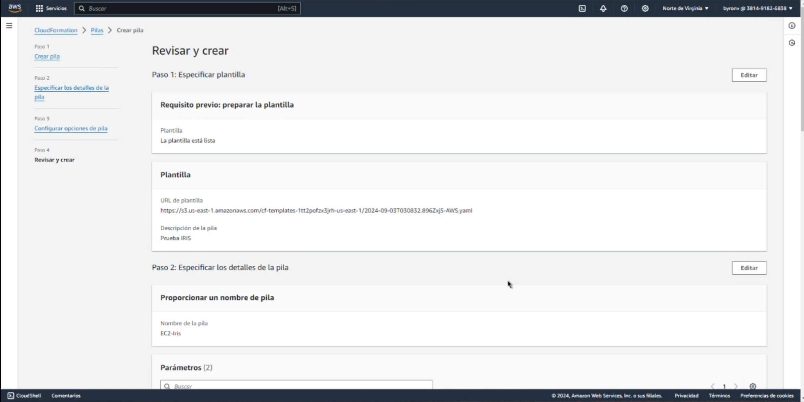

7. Enviar:

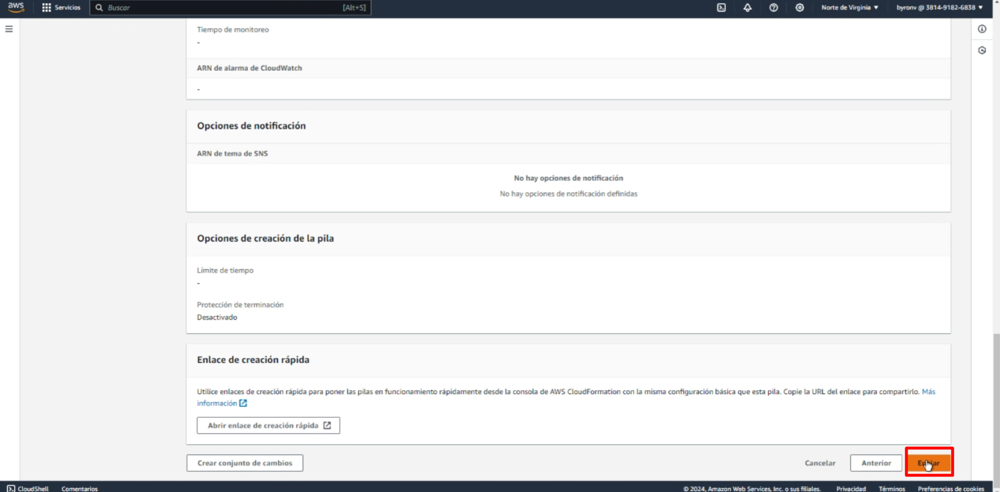

8. Actualizar la grilla y validar el estado de los eventos:

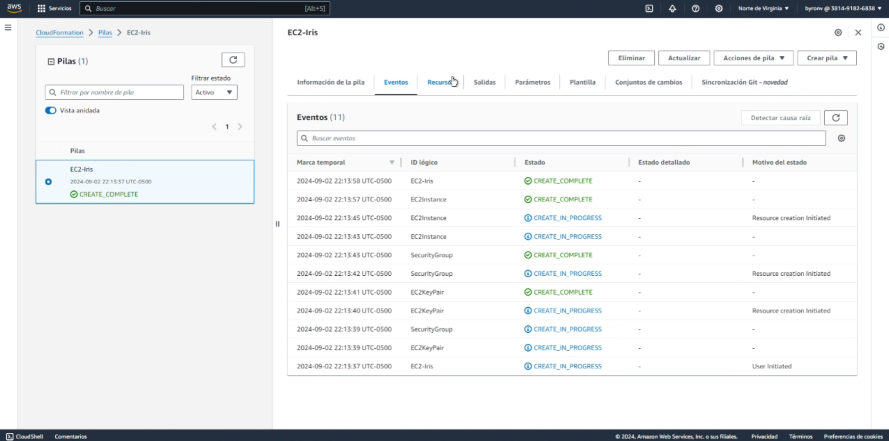

9. Resumen de la instancia:

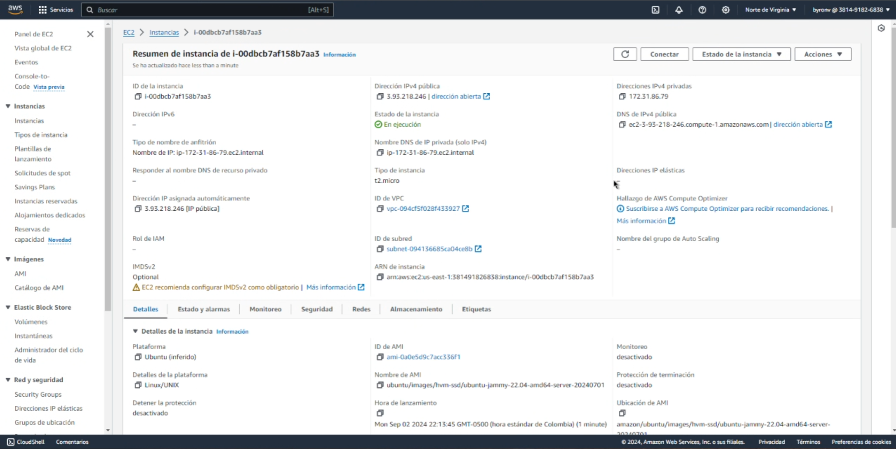

10. Zona de disponibilidad:

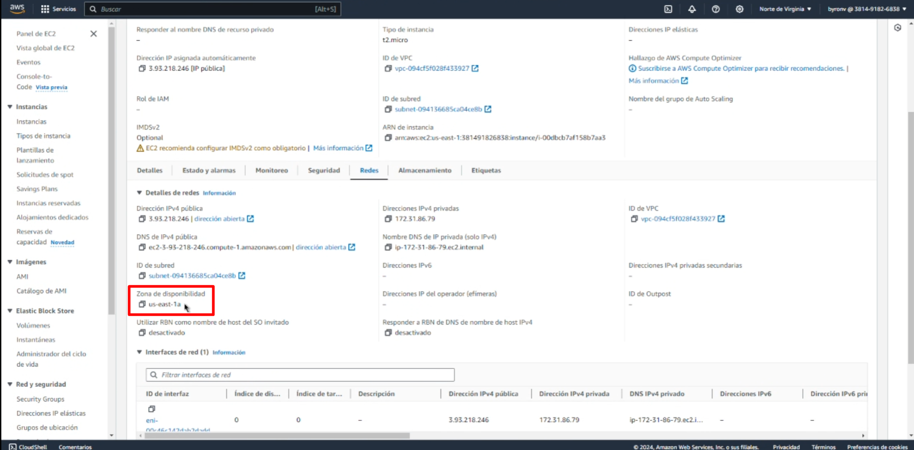

11. Grupo de seguridad:

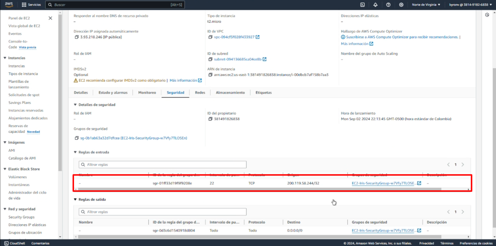

12. Clave de lanzamiento:

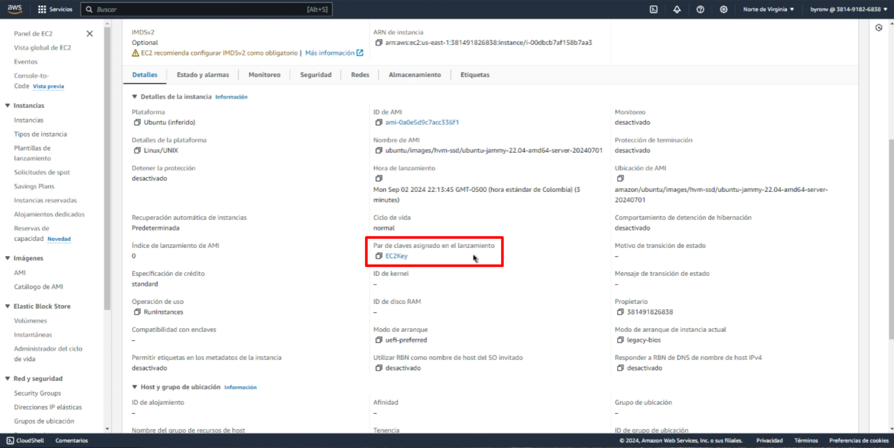

# 2. Crear un Pipeline de CI/CD básico con GitHub Actions:

En el directorio **/.github/workflows/** encontrará un pipeline llamado **ci.yml** , el cual especifica el siguiente comportamiento:

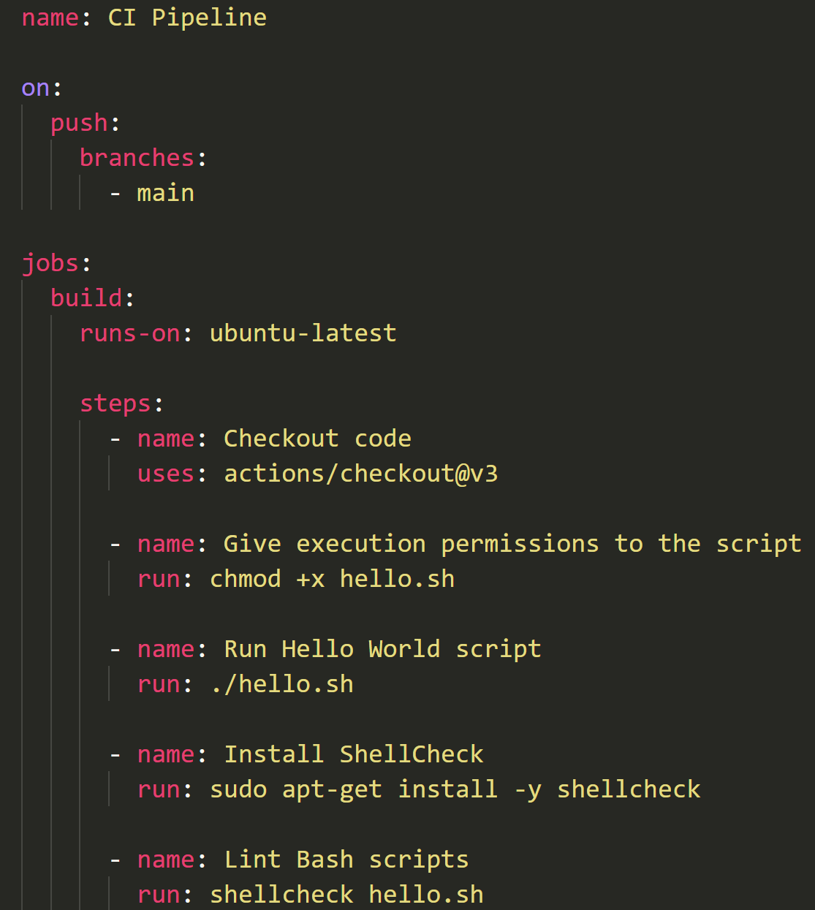

1. Se ejecutará cuando se haga push a la rama **main**

2. El sistema operativo sobre el que se ejecutará el job es **ubuntu-latest**

3. Obtiene el código del repositorio para que los siguientes pasos puedan trabajar con él.

4. Da permisos de ejecución al script hello.sh

5. Ejecuta el archivo **hello.sh** el cual imprime **"Hello, World!"**

6. Instala **shellcheck** para validar el código.

7. Ejecuta **shellcheck** en el script **hello.sh**

# 3. Construir y ejecutar una aplicación Docker:

En este ejercicio vamos a "dockerizar" una aplicación de Node.js que utiliza Express para responder a una solicitud Http con el método GET, respondiendo con el mensaje de "Hello, DevOps!".

## Instrucciones

1. Entrar al diretorio **Punto-3** el cual contiene los siguientes ficheros:

- **.dockerignore:** especifica los archivos a ignorar durante la "dockerización".
- **Dockerfile:** Este archivo especifica los pasos para generar la imagen, contenedor y sus caracterisiticas de arranque.
- **index:** Archivo de JavaScript que contiene el código fuente de la aplicación de Node. (Aquí se especifica el puerto por el cual se escucharán las solicitudes; usaremos el **3000**)
- **package.json:** Este archivo define la metadata del proyecto de Node, y sus dependencias necesarias para su correcto funcionamiento.

2. Abrir **Docker Desktop**.

3. Ejecutar lo siguiente comandos dentro del directorio **Punto-3:**

```docker
docker build -t punto-3 .
```

Este comando buscará el archivo **Dockerfile** para generar un contenedor a partir de la imagen especifica en el archivo, y la llamará "punto-3".

```docker
docker run -p 3000:3000 punto-3
```

Este comando ejecutará el contenedor a partir de la imagen, mapeando el puerto del contenedor y de nuestra máquina en el 3000, e iniciará el aplicativo web:

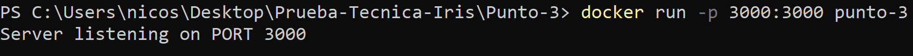

El mensaje **Server listening on PORT 3000** nos indica el puerto por el cual podemos realizar la solicitud:

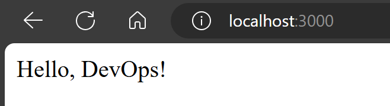
